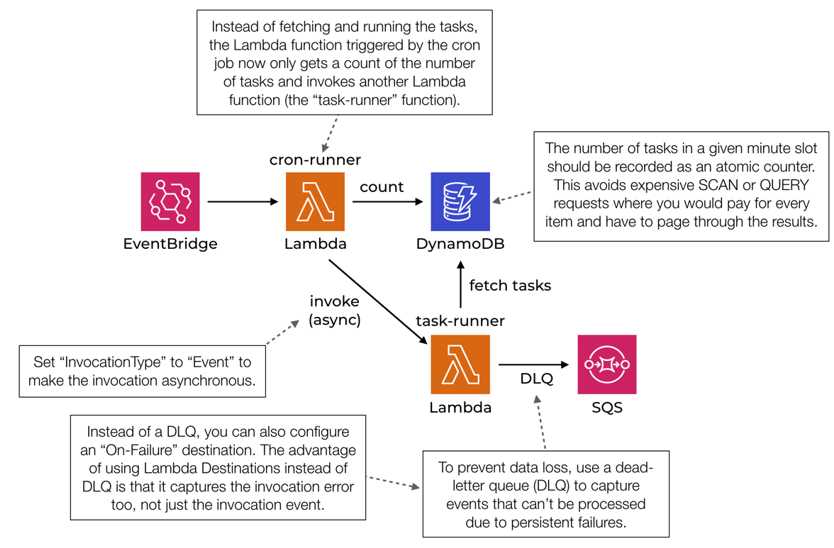
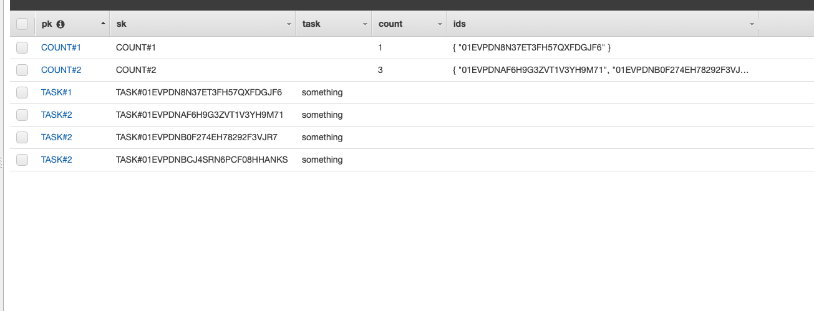

# Sharding test

This repository contains a very messy implementation of the following architecture

I've taken it from [this book](https://www.manning.com/books/serverless-architectures-on-aws-second-edition?query=serverless), chapter 7.

The code is very messy, but I wanted to try implementing the sharding technique on DDB. Sharding is used to avoid hot partition problem.

## Implementation

Tasks are sharded across 2 partitions

I'm using sets to keep track of ids. These come in very handy while doing the fan-out
